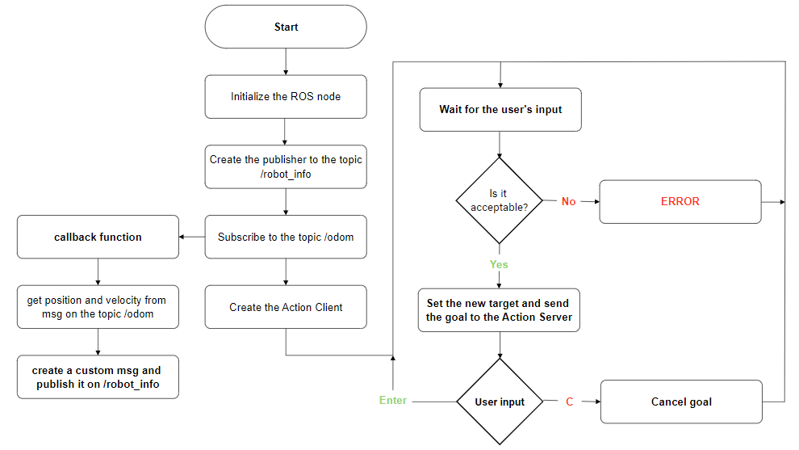

# ResearchTrack_Assignment2

Student: Matteo Cappellini (4822622)

Goal of the assignment
---------------------------

The goal of this assignment is to design three ROS nodes in order to control a mobile robot inside a simulated enviroment in Gazebo.

The three nodes needed to be implemented following these specifications:

- (a) A node that implements an action client, allowing the user to set a target (x, y) or to cancel it. The node
also publishes the robot position and velocity as a custom message (x,y, vel_x, vel_z), by relying on the values
published on the topic /odom.
- (b) A service node that, when called, prints the number of goals reached and cancelled.
- (c) A node that subscribes to the robot’s position and velocity (using the custom message) and prints the
distance of the robot from the target and the robot’s average speed.

The nodes
---------------------------

There are six nodes in this package, three of which were already provided:

- `go_to_point_service.py`: is the service node that makes the robot move towards the desired position

- `wall_follow_service.py`: is the service node that makes the robot avoid obstacles by moving around them

- `bug_as.py`: is the is the action server node that switches between the two services when needed

And here are the three nodes designed by me:

- `NodeA.py`: is the action client node that allows users to input the desired coordinates and to cancel the previously set goal, it also publishes the current coordinates of the robot by retrieving them via a ROS message from the topic _/odom_ and by publishing the robot position and velocity on the topic _/robot_info_ via a custom ROS message, as described in the following flowchart:



- `NodeB.py`: is the service node that prints the counters relative to the number of goals reached and cancelled

- `NodeC.py`: is the service node that prints the distance of the robot from the goal position and the average speed, these values are retrieved from the topic _/robot_info_ published as a custom ROS message from NodeA, the speed at which these informations are printed is set as a parameter in the launch file

Documentation
---------------------------

See the nodes documentation [here](https://matteocappe.github.io/ResearchTrack1_Assignment2/index.html)

Running the simulation
---------------------------

First of all you need to install xterm to be able to correctly visualize the nodes, you can do this by running the following code in(?) the terminal:

```
sudo apt-get install xterm
```

To download the package move to the `src` folder inside you ROS workspace and clone the repository by typing:

```
git clone https://github.com/MatteoCappe/ResearchTrack_Assignment2.git
```

To be able to run the program make sure that every python file have the permission to be executed, to do so, through terminal move to the `scripts` folder of this repository and type:

```
chmod +x *.py
```

Then make sure to move to the root folder of your ROS workspace and type:

```
catkin_make
```

Start the ROS master:

```
roscore
```

Now you are finally set to run the project by running the launch file:

```
roslaunch assignment_2_2022 assignment1.launch 
```

You can also run the simulation via jupyter notebook to observe the plots by running the launch file:

```
roslaunch assignment_2_2022 assignment2.launch 
```

Start the jupyter node via the command:

```
jupyter notebook --allow-root
```

To be able to test the program, open a web browser, go to the displayed URL and open the jupyter node inside the directory `jupyter_notebook`, finally run all the cell and you're set to go!

Once all these steps are done, five new windows will open:

- **Rviz**: a 3D visualizer for the ROS framework, which logs every information related to the robot's sensors
- **Gazebo**: the simulation enviroment in which we can see the arena and the robot moving
- **Xterm**: three xterm windows will open, one for each node; the user will be able to interact with them and set/cancel goals (NodeA), see the number of goals reached and cancelled (NodeB) and see the current position and velocity of the robot (NodeC)


Node Graph
---------------------------


Possible improvements
---------------------------

Some possibile improvements are:

- Setting a token in the gaebo simulation, where the goal is supposed to be, to have a better visualization of it
 
- Make the scripts as general as possible by getting the dimension of the arena at the start of the simulation and using the acquired informations to set the limitatins imposed on NodeA, so that we can have a more general script and be able to use the same code for arenas different from the one observed
